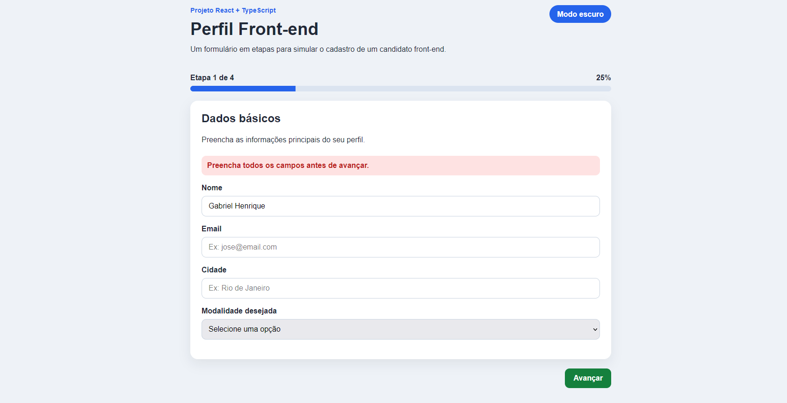

PROJETO: Multi-step Profile

Formulário de multi-etapas em React + TypeScript com validação, podendo mudar o tema entre claro e escuro, e rascunho salvo no localStorage.

>>> Funcionalidades:

- Formulário dividido em etapas.

- Etapas de dados básicos, conhecimentos, preferências e revisão final.

- Botão para avançar e voltar entre as etapas.

- Validação simples dos campos.

- Barra de progresso.

- Resumo final antes do envio.

- Mensagem de sucesso ao finalizar.

- Tema claro e escuro.

- Rascunho salvo no localStorage.

>>> Tecnologias usadas:

- React.
- TypeScript.
- CSS.
- localStorage.
- Vite.

>>> Como rodar o projeto:

- npm install
- npm run dev

>>> Status:

- Projeto finalizado para o portfólio.

>>> Deploy:

https://multi-step-profile-seven.vercel.app/

>>> Screenshot:

>>>>> Autor:

Feito por Gabriel Henrique.